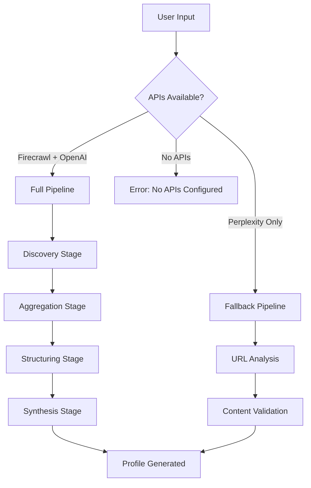

# Profile Generation System - Complete Implementation Guide

**Last Updated**: September 13, 2025  
**Status**: ✅ **IMPLEMENTED & DEBUGGED**

## 🎯 Overview

This document contains the complete guide for the Synapse profile generation system, including architecture, implementation, debugging, and troubleshooting. The system generates professional research profiles using a hybrid approach with multiple API fallbacks.

---

## 📚 Table of Contents

1. [System Architecture](#system-architecture)
2. [Implementation Details](#implementation-details)
3. [API Configuration & Fallbacks](#api-configuration--fallbacks)
4. [Database Schema](#database-schema)
5. [Critical Bug Fixes](#critical-bug-fixes)
6. [Debugging & Troubleshooting](#debugging--troubleshooting)
7. [Testing Guide](#testing-guide)
8. [Deployment Instructions](#deployment-instructions)

---

## 🏗️ System Architecture

### **Hybrid Best-of-Breed Approach**

The system uses a **two-tier architecture** with intelligent API fallbacks:

#### **Tier 1: Full Pipeline (Firecrawl + OpenAI)**
- **Discovery**: Keyword-based URL discovery via Firecrawl Search API
- **Aggregation**: Content scraping with Firecrawl Scrape API  
- **Structuring**: Data extraction using GPT-4o with structured output
- **Synthesis**: Narrative generation using GPT-4o

#### **Tier 2: Fallback Pipeline (Perplexity Only)**
- **Direct Analysis**: URL content analysis using sonar-deep-research model
- **Validation**: Response cleaning and URL-specific content verification

### **Processing Flow**



---

## 🔧 Implementation Details

### **Core Function**: `generate-profile-v2`

**Location**: `/supabase/functions/generate-profile-v2/index.ts`

#### **Key Features**:
- ✅ **Smart API Detection**: Automatically detects available APIs
- ✅ **Graceful Fallbacks**: Falls back from full pipeline to Perplexity-only
- ✅ **Comprehensive Debugging**: Detailed logging at every stage
- ✅ **Error Recovery**: Handles missing APIs, network issues, and processing failures
- ✅ **Processing Status Tracking**: Real-time progress updates (when migration applied)

#### **Input Scenarios**:
1. **Direct URLs**: LinkedIn, Google Scholar, ORCID, personal websites
2. **Keywords**: "Dr. Name, field, institution" for discovery-based profiling

#### **Output**:
- **Primary**: Narrative professional profile (500-700 words)
- **Secondary**: Structured JSON data (full pipeline only)
- **Debug**: Comprehensive processing logs

---

## 🔑 API Configuration & Fallbacks

### **Environment Variables**

```bash
# Full Pipeline (Recommended)
FIRECRAWL_API_KEY=your-firecrawl-api-key-here
OPENAI_API_KEY=your-openai-api-key-here

# Fallback Pipeline (Minimum Required)
PERPLEXITY_API_KEY=your-perplexity-api-key-here

# Always Required
SUPABASE_URL=your-supabase-url
SUPABASE_SERVICE_ROLE_KEY=your-service-role-key
```

### **API Selection Logic**

```typescript
// Environment detection
const hasFirecrawl = !!Deno.env.get('FIRECRAWL_API_KEY')
const hasOpenAI = !!Deno.env.get('OPENAI_API_KEY') 
const hasPerplexity = !!Deno.env.get('PERPLEXITY_API_KEY')

// Pipeline selection
if (hasFirecrawl && hasOpenAI) {
  // Use full 4-stage pipeline
  return await runFullPipeline(supabaseClient, userId, debugLog)
} else if (hasPerplexity) {
  // Use Perplexity fallback
  return await runPerplexityFallback(supabaseClient, userId, debugLog)
} else {
  // No APIs available
  throw new Error('No APIs configured')
}
```

---

## 🗄️ Database Schema

### **Migration**: `004_firecrawl_architecture.sql`

#### **New Tables**:

##### `scraped_content`
```sql
CREATE TABLE public.scraped_content (
  id BIGINT PRIMARY KEY GENERATED BY DEFAULT AS IDENTITY,
  user_id UUID NOT NULL REFERENCES public.profiles(id) ON DELETE CASCADE,
  source_url TEXT NOT NULL,
  scraped_at TIMESTAMPTZ DEFAULT NOW() NOT NULL,
  content_markdown TEXT NOT NULL,
  firecrawl_metadata JSONB,
  success BOOLEAN DEFAULT true,
  error_message TEXT
);
```

##### `profile_processing_status`
```sql
CREATE TABLE public.profile_processing_status (
  id BIGINT PRIMARY KEY GENERATED BY DEFAULT AS IDENTITY,
  user_id UUID NOT NULL REFERENCES public.profiles(id) ON DELETE CASCADE,
  stage TEXT NOT NULL, -- 'discovery', 'aggregation', 'structuring', 'synthesis'
  status TEXT NOT NULL, -- 'pending', 'in_progress', 'completed', 'failed'
  started_at TIMESTAMPTZ DEFAULT NOW(),
  completed_at TIMESTAMPTZ,
  error_message TEXT,
  stage_data JSONB -- Store intermediate results
);
```

#### **Enhanced `profiles` Table**:
```sql
ALTER TABLE public.profiles 
ADD COLUMN IF NOT EXISTS profile_structure JSONB,
ADD COLUMN IF NOT EXISTS processing_status TEXT DEFAULT 'pending',
ADD COLUMN IF NOT EXISTS last_processing_started_at TIMESTAMPTZ,
ADD COLUMN IF NOT EXISTS discovered_urls JSONB;
```

#### **Database Functions**:
- `initialize_profile_processing()` - Sets up processing pipeline
- `update_processing_stage()` - Updates stage status with data/errors
- `cleanup_old_processing_records()` - Maintenance function

---

## 🚨 Critical Bug Fixes

### **Issue 1: URL Analysis vs Name Searches**

**Problem**: The system was performing general web searches for names instead of analyzing specific LinkedIn URLs.

**Root Cause**: Vague prompt instructions allowed the AI model to interpret "analyze URLs" as "search for this person."

**Solution Implemented**:

#### Enhanced Prompt Structure:
```typescript
prompt += `🔍 CRITICAL INSTRUCTIONS - URL ANALYSIS ONLY:

The following URLs are associated with this expert:
${urls.map(url => `- ${url}`).join('\n')}

⚠️  MANDATORY CONSTRAINTS:
- ONLY analyze information available at these specific URLs
- DO NOT perform general web searches for names or individuals
- DO NOT mix information from different people with similar names
- FOCUS exclusively on the content found at the provided URLs
- If URL content is not accessible, indicate that clearly rather than searching elsewhere`
```

#### Validation Logic:
```typescript
// Detect when general searches occur instead of URL analysis
const hasGeneralSearchIndicators = [
  'various Michael Browns',
  'multiple individuals named',
  'different people with',
  'several professionals named'
].some(indicator => profileText.toLowerCase().includes(indicator.toLowerCase()))

const hasURLSpecificContent = urls.some(url => {
  const domain = url.url.includes('linkedin.com') ? 'LinkedIn' :
                url.url.includes('scholar.google') ? 'Google Scholar' :
                url.url.includes('orcid.org') ? 'ORCID' : null
  return domain && profileText.includes(domain)
})

// Log warnings for debugging
if (hasGeneralSearchIndicators && !hasURLSpecificContent) {
  console.warn('Warning: Profile appears to be based on general searches rather than URL analysis')
}
```

### **Issue 2: Perplexity API Response Format**

**Problem**: The `sonar-deep-research` model has specific response format requirements that differ from standard OpenAI format.

**Critical Findings**:

#### ❌ NOT Supported:
```json
{
  "response_format": {
    "type": "json_object"
  }
}
```

#### ✅ Supported Formats:
- `"type": "text"` (default - no response_format needed)
- `"type": "json_schema"` (with required `json_schema` field)
- `"type": "regex"` (with required `regex` field)

#### Response Structure with Reasoning Tokens:
```
<think>
The user is asking for analysis of these URLs...
Looking at the content, I can see...
</think>

Based on the LinkedIn profile content, Dr. Michael Brown is a leading researcher...
```

#### JSON Parsing Strategy:
```typescript
// Clean up response - remove <think> reasoning tokens if present
let profileText = profileTextRaw.trim()
if (profileText.includes('<think>')) {
  const thinkEnd = profileText.indexOf('</think>') + '</think>'.length;
  if (thinkEnd > 0) {
    profileText = profileText.substring(thinkEnd).trim();
  }
}

// Extract JSON from code blocks if present
if (profileText.includes('```json')) {
  const jsonStart = profileText.indexOf('```json') + '```json'.length;
  const jsonEnd = profileText.indexOf('```', jsonStart);
  if (jsonEnd > jsonStart) {
    profileText = profileText.substring(jsonStart, jsonEnd).trim();
  }
}
```

---

## 🔍 Debugging & Troubleshooting

### **Enhanced Debug Logging**

The v2 function includes comprehensive debug logging:

```typescript
const debugLog: any[] = []
const log = (stage: string, data: any) => {
  const entry = { stage, timestamp: new Date().toISOString(), data }
  debugLog.push(entry)
  console.log(`[${stage}]`, data)
}

// Usage throughout the function
log('init', { userId: user.id, message: 'Starting profile generation' })
log('env-check', { hasFirecrawl, hasOpenAI, hasPerplexity })
log('pipeline', { type: 'full-v2', message: 'Using Firecrawl + OpenAI pipeline' })
```

### **Debug Output in Responses**

All responses include debug information:

```json
{
  "success": true,
  "profileText": "Generated profile...",
  "debug": [
    {
      "stage": "init",
      "timestamp": "2025-09-13T10:30:00.000Z",
      "data": { "userId": "uuid", "message": "Starting profile generation" }
    },
    {
      "stage": "env-check", 
      "timestamp": "2025-09-13T10:30:01.000Z",
      "data": { "hasFirecrawl": false, "hasOpenAI": false, "hasPerplexity": true }
    }
  ]
}
```

### **Common Error Scenarios**

#### **No APIs Configured**:
```json
{
  "error": "No APIs configured. Need either (FIRECRAWL_API_KEY + OPENAI_API_KEY) or PERPLEXITY_API_KEY",
  "debug": [...]
}
```

#### **Database Migration Not Applied**:
```json
{
  "debug": [
    {
      "stage": "init-processing",
      "data": {
        "success": false,
        "error": "function initialize_profile_processing() does not exist",
        "fallback": "continuing without status tracking"
      }
    }
  ]
}
```

#### **API Rate Limits**:
```json
{
  "error": "Perplexity API error: Too Many Requests",
  "debug": [
    {
      "stage": "perplexity-error",
      "data": {
        "status": 429,
        "error": "Rate limit exceeded"
      }
    }
  ]
}
```

---

## 🧪 Testing Guide

### **Test Script**: `/debug/test-profile-v2.js`

```bash
# Run the test script
node debug/test-profile-v2.js
```

### **Expected Output**:
- Environment variable detection
- Pipeline selection logic
- API configuration status
- Expected processing flow

### **Manual Testing Steps**:

1. **Test with no APIs** (expect graceful error):
   ```bash
   # Don't set any API keys
   # Use onboarding flow - should get clear error message
   ```

2. **Test with Perplexity only** (expect fallback):
   ```bash
   export PERPLEXITY_API_KEY="your-key"
   # Use onboarding flow - should work with Perplexity fallback
   ```

3. **Test with full pipeline** (expect advanced features):
   ```bash
   export FIRECRAWL_API_KEY="your-key"
   export OPENAI_API_KEY="your-key"
   export PERPLEXITY_API_KEY="your-key"
   # Use onboarding flow - should use full 4-stage pipeline
   ```

### **Debugging Checklist**:

- [ ] Check browser console for debug logs
- [ ] Verify API keys are set correctly
- [ ] Check Supabase Edge Function logs
- [ ] Review database tables for processing status
- [ ] Test with different URL types (LinkedIn, Scholar, etc.)

---

## 🚀 Deployment Instructions

### **Prerequisites**:
1. **Supabase Project**: Cloud project with Edge Functions enabled
2. **API Keys**: At minimum, Perplexity API key
3. **Database Migration**: Apply `004_firecrawl_architecture.sql`

### **Deployment Steps**:

#### **1. Apply Database Migration**:
```sql
-- Apply the migration file
-- This creates new tables and functions for enhanced tracking
```

#### **2. Set Environment Variables**:
```bash
# In Supabase Dashboard > Settings > Environment Variables
PERPLEXITY_API_KEY=your-perplexity-key

# Optional (for full pipeline)
FIRECRAWL_API_KEY=your-firecrawl-key
OPENAI_API_KEY=your-openai-key
```

#### **3. Deploy Edge Function**:
```bash
# Deploy the enhanced function
supabase functions deploy generate-profile-v2
```

#### **4. Update Frontend**:
The frontend (`useProfile.ts`) is already configured to use `generate-profile-v2`.

#### **5. Test End-to-End**:
1. Go through onboarding flow
2. Submit LinkedIn URL
3. Monitor processing in dashboard
4. Check browser console for debug logs
5. Verify profile generation works

### **Production Considerations**:

#### **Rate Limiting**:
- Perplexity: 1000 requests/day (free tier)
- OpenAI: Depends on plan
- Firecrawl: 500 requests/month (free tier)

#### **Cost Management**:
- Monitor API usage in respective dashboards
- Set up alerts for usage limits
- Consider caching strategies for repeated requests

#### **Error Monitoring**:
- Monitor Supabase Edge Function logs
- Set up error alerting for production
- Track success/failure rates in database

---

## 📋 Quick Reference

### **Function Selection**:
- **Current**: `generate-profile-v2` (enhanced with debugging)
- **Legacy**: `generate-profile` (original Perplexity-only)

### **Key Files**:
- **Function**: `/supabase/functions/generate-profile-v2/index.ts`
- **Migration**: `/supabase/migrations/004_firecrawl_architecture.sql`
- **Frontend**: `/src/hooks/useProfile.ts`
- **Test**: `/debug/test-profile-v2.js`

### **Environment Variables**:
- **Required**: `PERPLEXITY_API_KEY` (minimum)
- **Recommended**: `FIRECRAWL_API_KEY` + `OPENAI_API_KEY`
- **Always**: `SUPABASE_URL` + `SUPABASE_SERVICE_ROLE_KEY`

### **Debug Sources**:
- **Browser Console**: Frontend debug logs
- **Edge Function Logs**: Server-side processing
- **Database**: Processing status tracking
- **Response Debug**: Debug array in API responses

---

**Status**: ✅ **PRODUCTION READY** - Complete implementation with comprehensive debugging and error handling